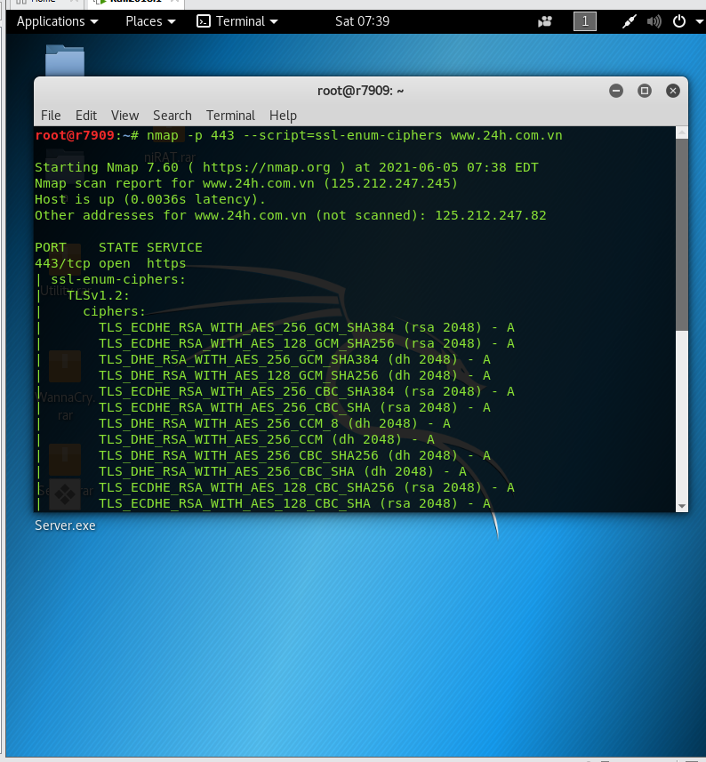

##542.1 

Giới thiệu và thu thập thông tin\

Day1: Introduction and information gathering

SANS security 504: Hacker techniques, Exploits, and incident handling: Ở phần này , các khóa học của sans tập trung chủ yếu và cách ứng phó với các cuộc tấn công máy tính bắng cách sử dụng giải pháp ứng phó sự cố bằng phương pháp luận

SANS security 542: Web app pentesting and ethical hacking: nếu bạn đang tập trung vào web, kiểm tra thâm nhập ứng dụng, khóa học này cung cấp các kĩ năng để bạn phân tích kĩ các ứng dụng web

SANS security 550: Active defense,  Offensive Countermeasures, and Cyber Deception: Cung cấp tư duy để bảo vệ environment của bạn một cách an toàn và hiệu quả

SANS security 560: Network penetration testing and ethical hacking: Bao gồm các công cụ, công nghê và các phương pháp pháp luận quan trọng nhất mà tổ chức cần để tiến hành kiểm thử mang lại mô hình lợi nhuận giá trị 

SANS security 561: Intese Hands-On Skill Development for Penetration Tester: Khóa học này cung cấp cho bạn 80% các kĩ năng để giúp bạn có thể xây dựng được kĩ năng kiểm thử nhanh chóng

SANS security 562: CyberCity Hands-On Kinetic Cyber Range: Khóa học này 80% là thực hành với các nhiêm vụ quan trọng

SANS security 573: Automating Information Security with Python: Phương pháp bảo mật này dành cho các chuyên gia thành thao python, và nó cho phép người dung chỉnh sửa cung cụ như thế nào để có thêm nhiều chức năng hơn

SANS security 575: Mobile Device Security và Ethical Hacking: Khóa học cung cấp các kiến thức để thiết kế, triển khai vận hành đánh giá môi trường di động bao gồm điện thoại thông minh và máy tính bảng

SANS security 617: Wireless Ethical Hacking, Pentesting and defenses: Cung cấp các kĩ năng bảo mật thông tin chuyên sâu và bảo vệ mạng Lan không dây thiết bị blutooth, vv

SANS security 642: Advanced web app pen testing and ethical hacking: Khóa học bảo mật web nâng cao

SANS security 660: Advanced penetration testing, exploits and ethical hacking: Giúp người kiểm tra khả năng nâng cao kĩ năng thâm nhập lên cấp độ tiếp theo và bao gồm các chủ đề NAC bypass, route injection

SANS security 760: Advanced exploit development for penetration Tester: Đây là kĩ thuật chuyên sâu nhất của chúng tôi cung cấp với tác nhân của windows sửa lỗi khác và nhiều cuộc tấn công và khai thác khác

Web applications

- Có mặt trên mọi nơi với mọi quy mô và loại hình kinh doanh
- Chức năng quan trọng với doanh nghiệp
- Cung cấp quyền truy cập vào dữ liệu nhạy cảm và quan trọng

Hầu hết các tổ chức không nhấn mạng đến việc bảo vệ ứng dụng

- Thường gặp với nhà phát triển kém thành thạo về bảo mật ứng dụng
- Điển hình cho việc các chuyên gia bảo mật thiếu kiến thức và kĩ năng trong lĩnh vực này

Nhiều doanh nghiệp chỉ kiểm tra chức năng  kinh doanh và ứng dụng triển khai trên web

Kiểm tra đánh giá thậm nhập vị trí bảo mật của ứng dụng

Phương thức này sẽ là trọng tâm của lớp này nhưng nhiều cách tiếp cận khả thi khác nhau để đánh giá tính bảo mật của ứng dụng

Hiểu cách kiểm tra ứng dụng web để chứng minh sự quan trọng

Có thể không phải là công cụ phù hợp hoặc tốt nhất cho một ứng dụng nhất định

Có thể cần được bổ sung tiếp cận bằng các cách tiếp cận khác

Asessensing application security

Các mô hình mối đe dọa

Code review

Các phương pháp kiểm tra bảo mật

SAST

DAST

IAST2

OAST3

Đánh giá kiểm tra grayscale

Black/white/grey box testing

Black box 

- Không có hiểu biết, không điển hình
- Không cung cấp quyền truy cập mã nguồn, tài khoản người dung, quyền truy cập cho admin

White box

- Kiểm tra bảo mật kiến thức với đầy đủ quyền truy cập vào mã nguồn ứng dụng tài khoản kiến thức về ứng dụng và quyền truy cập vào các nhà phát triển

Gray box

- Hầu hết các thử nghiệm để rơi vào vùng màu xám giữa màu đen và màu trắng một cách hợp pháp

SAST

SAST liên quan đến việc xem xét kĩ lưỡng các mã nguồn ứng dụng đang tìm kiếm các thiếu sót bảo bật

Sử dụng các công cụ thay vì chỉ dựa vào việc xem xét mã thủ công

- Tuy nhiên, SAST có thể xem là một đánh giá mã tự động và hiệu quả
- Được đánh giá như một kĩ thuật kiểm tra hộp trắng do quyền truy cập mã nguồn được yêu cầu cho loại thử nghiệm này

Điểm mạnh: Xác định các thiếu sót bảo mật không dễ thấy trong ứng dụng triển khai

Điểm yếu:      Yêu cầu quyền truy cập vào mã nguồn, có thể bỏ qua các API hoặc các thư viện được tận dụng, bỏ qua các phần hoạt động động của ứng dụng

DAST

sác định các lỗi bảo mật thông qua tương tác với ứng dụng đã triển khai

Điểm mạnh: Có thể coi là một hình thức kiểm tra hộp đen do thiếu mã nguồn

Các công cụ DAST Không yêu cầu quyền truy cập mã nguồn, nhất thiết phải có tài khoản cho phía hoạt động của ứng dụng, có thể được tự động hóa, quy mô tốt cho các ứng dụng lớn

Điểm yếu: Chỉ tốt như công cụ, cấu hình của nó và người dung sử dụng nó

Công cụ DAST đóng vai trò quan trọng trong ứng dụng web kiểm thử

Sử dụng các công cụ DAST một cách hiệu quả

- Cấu hình cho ứng dụng 
- Hướng dẫn quét để đảm bảo xem xét toàn diện
- Theo dõi kết quả để giảm những phát hiện không chính xác
- Đánh giá những mặt tích cực để hiểu được tác động tiềm ẩn
- Hiểu và khắc phục những khiếm khuyết về năng lực

Tools Dast

Free/Open Source

- ZAP active scan
- SQL map( SQL injection specific)
- W3AF
- Metasploit WMAP
- WPScan

Comercial 

- Acunetix 
- Burp Scanner
- IBM appscan
- Qualys WAS
- Rapid 7 Appspider
- Veracode dynamic analysis
- ZAP scan

Chuẩn bị thiết bị

Máy ảo VMware workstation 15

USB port

CPU 2.0+hz

Ram >=8GB

Full quyền admin và ngắt kết nối firewall antivirus

Lập kế hoạch cẩn thận khi đi vào xây dựng web

Bộ công cụ của người kiểm tra

Môi trường tấn công

Các công cụ scan và phân tích web động

Trình duyệt

Các proxy đánh chặn

WHOIS và DNS

WHOIS là giao thức cung cấp cho máy khách và máy chủ quyền truy cập thông tin về các miền IPv4 và IPv6 netblocks

Sử dụng port 43

Được mô tả bở RFC3912

Các công ty đăng kí chạy WHOIS server cũng như nhiều công ty đăng kí ISP

Sử dụng Whois ta có thể nhận được

- Tên và số điện thoại
- Địa chỉ vật lý
- DNS

Ta nhận được địa chỉ IP của máy chủ DNS cho web kiểm tra thâm nhập

DNS là hệ thống phân giải địa chỉ tên miền, một dữ liệu được phân cấp

- Sử dụng UDP cho port 53 nếu lương thông tin <= 512 byte
- Sử dụng TCP cho port 53 nếu lương thông tin > 512 byte

Tính đến năm 2016 đã có 1500 DNS 

DNS có thể cung cấp nhiều thông tin và đặc biệt hữu ích để khám phá máy ảo

Reverse DNS scan: Dịch ngược DNS

Brute Force DNS: Cung cấp một từ điển các DNS< Tấn công vét cạn>

Sử dụng các công cụ do thám DNS

- Nslookup, Nmap, DNSRecon, Meta

Nslookup: Công cụ để scan DNS

- Tính khả dụng hầu như phổ biến bao gồm UNIX, LINUX, MACos và window
- Hữu ích để xác định được các lỗ hổng
- 1 số tính năng đã được xóa khỏi các phiên bản mới hơn

Dig: Là một DNS client đầy đủ tính năng

- Có sẵn trên macOS và các phiên bản có nhân UNIX/Linux
- Nó không được cài đặt trên windows 

DNSRecon của carlos perez: Thực hiện nhiều chức năng trinh sát DNS

- Có sẵn trong /opt/dnsrecon/dnsrecon.py in the Sec542 Linux VM
- Bao gồm 1 số danh sách được sử dụng để quét DNS brute force
- Các tính năng nâng cao bao gồm hỗ trợ DNSSEC và mDNS
- Carlos cũng đã chuyển nhiều chức năng DNSRecon sang Metasploit module phụ

Metasploit có 1 số công cụ hỗ trợ thu thập thông tin DNS hữu ích

DNS523 WORKBOOK: DNS Harvesting

OTG: Thu thập thông tin

OTG-INFO-001: Tiến hành do thám và khám phá các công cụ tìm kiếm

OTG-INFO-002: Máy chủ web Finger

OTG-INFO-003: Xem lại các tệp tin máy chủ trang web về rò rỉ thông tin

OTG-INFO-004: Liệt kê các ứng dụng sử dụng trang web

OTG-INFO-005: Đánh giá trang web

OTG-INFO-006: Xác định điểm đầu vào ứng dụng

OTG-INFO-007: Định hướng cách thực thi qua ứng dụng

OTG-INFO-008: Ứng dụng của môi trường web vân tay

OTG-INFO-009: Ứng dụng web Finger

OTG-INFO-010: Kiến trúc sư ứng dụng

` `OSINT là 1 cụm viêt tắt cho Open Source Intelligency . Trong đó OS là Open Source hay còn gọi là những nguồn mở được public trên internet và Intelligency là Tình báo (sự thu thập các tin tức). Từ đó ta có thể hiểu được là đây chính là những phương thức, cách thức khai thác lấy những thông tin từ video,hình ảnh, văn bản,.. từ những gì liên quan đến mục tiêu có sẵn và đang public trên internet. Những nguồn đó có thể ở bất cứ đâu : trên forum, trên các trang báo,trong 1 cuốn sách, video hay là những thư viện mở,các báo cáo và lịch sử từ trước đó.

Công cụ rõ ràng nhất của OSINT đơn giản là tìm kiếm

Hầu hết mọi người chỉ tận dụng công cụ tìm kiếm yêu thích của họ và không suy nghĩ nhiều. Đối với tìm kiếm cơ bản thì điều này có vẻ ổn, còn với tìm kiếm nâng cao điều này nên có chút thay đổi

OSINT: Các từ khóa để search

Site:
Cache:
Filetype:
Intitle:
Inurl:
Contain:
OSINT: google docks,

GHDB( google hacking database): Nơi những lỗ hồng được update lên hằng ngày

OSINT: Cache content

Wayback machine: Search các phiên bản cũ hơn của web

Shodan.io: Là công cụ tìm kiếm đầu tiên trên thế giới dành cho các thiết bị kết nối Internet

Có tại: <http://www.shodan.io>. Công cụ này cho phép tìm kiếm máy tính, thiết bị Internet (IOT). Ví dụ như webcam, bộ định tuyến, điện thoại, voiIP

Khi ta đi đến IP mà shodan tìm thế ta sẽ truy cập được vào máy chủ nhưng 1 số sẽ yêu cầu tính năng xác thực. Ở đây ta sẽ gặp 1 số trường hợp khi và ta login vào với username: admin và pass: admin thì hệ thống báo login success nhưng trường hợp đó thì thường rất ít khi xảy ra

Shodan có thể tiết lộ các hệ thống nằm trong phạm vi nào nhưng đây không phải là vị trí chính xác hiện tại. Có thể ở đây bao gồm cả hệ thống do bên thứ 3 quản lý thay cho client. Khi tìm kiếm tên của client ở trên shodan ta phải chú ý đến thiết bị bên ngoài IP của client

Ngoài ra hay thảo luận về các loại hệ thống của client

OSINT: Social Media – Linkedln

Phương tiên tuyền thông xã hội chứa 1 lương lớn thông tin mà chúng ta cần khai thác

OSINT: Metadata 

Nhiều loại file chứa dữ liệu bổ sung ngoài nội dung mà chúng ta cần tìm hiểu

OSINT: exiftool

Exiftool siêu dữ liệu ở nhiều định dạng tệp khác nhau ngoài những hình ảnh

Tài liệu: DOC/XLS/PPT/PDF

Tệp nén: Gz, RAR, ZIP

Hình ảnh: BMP,GIF,JPEG,PNG, TIFF

Âm thanh: MOV,MP3,MP4,WM

OSINT: Tesseract

FOCA: ( Tổ chức lấy dấu vân tay với kho lưu trữ được thu thập bở ElenventPaths) là công cụ tìm kiếm tài liệu

- FOCA PRO được gọi là phiên bản cuối cùng
- Phiên bản 3.4
- Chạy miễn phí trên windows
- EleventPaths đã tạo ra một dịch vụ có tên là”FaasT” với tư cách là phần mềm tiếp theo  của FOCA

FOCA có thể tìm kiếm tất cả tài liệu trong một miền

- Tải xuống và phân tích chúng
- Tạo danh sách metadata
- Metadata bao gồm: người dung, máy in, phần mềm, email, hệ điều hành, mật khẩu

Ngoài ra chúng ta có Maltengo, Spiderfoot, theHarvester,AutOSINT

The WEB: World Wide Web được thiết kế để tương đương với một máy chủ FTP ẩn danh

- Tất cả dữ liệu được công khai
- Không có chứng thực
- Không có mã hõa
- Mỗi lần tải xuống là 1 phiên
- 1 máy chủ = 1 máy chủ web không có máy chủ ảo

HTTP/0.9

Phiên bản đầu tiên của HTTP hỗ trợ một phương thức GET đơn giản 

- Giao thức này có tên trước đây là HTTP/0.9
- GET là phương thức được hỗ trợ duy nhất
- Client GET request là một dòng đơn được kết thúc bở CRFL
- Không có tiêu đề nào của máy client được hỗ trợ
- Không hỗ trợ virtual server
- Chỉ trả về HTML
- Một GET == một kết nối TCP
- Nhiều loại máy chủ web hiện đại( bao gồm cả Apache và Nginx) hỗ trợ HTTP/0.9 theo mặc định

HTTP/1.0

- RFC 1945 mô tả HTTP/1.0 được phát hành vào tháng 5 năm 1996
- Tiêu chuẩn HTTP chính thức đầu tiên
- Đã thêm các support bổ sung ngoài phương thức GET
- GET và HEAD được mô tả là phương phát an toàn( chúng không sửa đổi nội dung)
- POST, PUT, DELETE cũng mô tả 
- Phản hồi của máy chủ không phải HTML 
- Không hỗ trợ máy chủ ảo
- Một GET = 1 TCP

HTTP/1.1

- RFC 2616 mô tả HTTP/1.1 được phát hành vào tháng 6 năm 1999
- Được bổ sung bở các RFC HTTP/1.1 khác vào năm 2014
- Đã them hỗ trợ virtual server
- Tiêu đề host là bắt buộc với các yêu cầu máy client HTTP/1.1
- Cho phép kết nối liên tục
- Nhiều yêu cầu thông qua TCP/IP
- Đã thêm phương thức OPTIONS
- Hỗ trợ tốt hơn cho bộ nhớ đệm, proxy và nén

HTTP/2

- Trọng tâm chính của bản cập nhật HTTP/2 là đạt được hiệu suất nhanh hơn bằng cách cập nhật cách thức hoạt động của HTTP
- HTTP/2 mang đến thay đổi đáng kể cho HTTP
- Giao thức nhị phân
- Nén tốt hơn
- Giảm chi phí và độ phức tạp khi phân tích
- Push Promise – Máy chủ web có thể gửi nội dung máy client trước khi nó được yêu cầu
- Multiplexed not Pipelined – một kết nối TCP trên mỗi điểm gốc đồng thời thực hiện nhiều cầu/phản hồi
- HPACK – Giao thức được thiết kế cho nén tiêu đề HTTP/2
- HTTP/2 không yêu cầu mã hóa

QUIC-HTTP/3 

- Là một giao thức được thiết kế bởi google bảo đảm thông tin cung cấp qua HTTP/3 nhanh hơn đáng kể
- QUIC sử dụng port 80, 443 tương ứng với HTTP, HTTPS
- Cả hai đều được mã hóa nhưng cổng 80 không xác minh chứng chỉ máy chủ 
- QUIC là 1 phương thức truyền tải mới giúp giảm tốc độ so với TCP. QUIC rất giống với TCP+TLS+HTTP/2 được thực hiện trên UDP
- Chorm sẽ sử dụng QUIC cho các trang web hỗ trợ QUIC bảo gồm cả web của google
- ZAP và burpsuit đề không hỗ trợ QUIC

HTTP semantic

- Hiểu tất cả các khía cạnh khác nhau của HTTP
- Nội dung ban đầu tương tự với HTTP/0.9, HTTP/1.0, HTTP/1.1, HTTP/2, QUIC/HTTP/3
- Sự khác biệt cơ bản liên quan đến việc truyền dữ liệu qua mang
- Đọc các yêu cầu phù hợp và kiểm tra phản hồ từ CLI đến cURL hoặc qua proxy chặn của chúng tối, Burp hoặc ZAP là một nhiệm vụ thiết yếu trong quá trình thử nghiệm

Example HTTP request

Example HTTP response

HTTP request: Methods/ Verbs

- GET
- HEAD
- POST
- PUT
- DELETE
- CONNECT
- OPTIONS
- TRACE
- PATCH

HTTP request: Get the uri

- Việc sử dụng phần thân http có nghĩa là tất cả các trao đổi dữ liệu phải đươc giao tiếp trong HTTP
- HTTP GET sử dụng HTTP URI để truyền dữ liệu

HTTP request methods: POST

- HTTP POST phương thức yêu cầu HTTP phổ biến thứ 2 không giống như GET, các yêu cầu HTTP POST sử dụng dữ liệu trong nội dung thông báo HTTP cho trao đổi dữ liệu
- Tuy đơn giản nhưng điều này thể hiện sử khác biệt đáng kể giữa GET và POST 

HTTP request methods: HEAD

- PHương thức yêu cầu HTTP an toàn tạo ra phần hồi của máy chủ
- Chỉ các tiêu đề HTTP sẽ được trả về một yêu cầu HEAD

HTTP request methods: TRACE

- Phương thức được thiết kế để khắc phục sự cố không kích hoạt được trong quá trình làm việc
- Hỗ trợ trace được coi là một phát hiện trong bất kì đánh giá nào

HTTP request methods: Option

HTTP request: Cookie and set cookie

- Ứng dụng thiết lập follow người dung qua các phiên bằng cách sử dụng cookie

HTTP request: Status code

1xx: information

2xx: success

3xx: redirection

4xx: client error

5xx: server error

HTTP response: Cacheable and cache-control

- Vì 1 số mục đích một số nội dung HTTP có thể được lưu vào bô nhớ cache cục bộ
- Nếu được lưu vào bộ nhớ cache thành công, trình duyệt sẽ không gửi request lại
- Nội dung có thể được lưu vào bộ nhớ đệm hay không phụ thuộc vào phương thức yêu cầu- chỉ phản hồi cho GET và HEAD thường có thể lưu vào bộ nhớ cache mã trạng thái – 200,203,204,206,300,404,405,410,412,5012

HTTP response: Server

- Máy chủ cung cấp phản hồi tương đương với head của user agent
- Cho biết máy chủ web gần nhất với người dung cuối
- Server có thể được định cấu hình

HTTPS: Transmisson security for http

- HTTP trình bày là một giao thức chủ yếu văn bản rõ rang
- Các phiên bản gần đây của HTTP có bao gồm các phần tử nhị phân nhưng về tính bảo mật dữ liệu thì không
- SSL/TLS được sử dụng để mang lại bảo mật truyền tới HTTP
- Phiên bản SSL cuối cung 3.0 được phát hành vào năm 1996
- Phiên bản phổ biến nhất TLS 1.2 ra mắt trong 2008
- RFC cho TLS 1.3 phát hành năm 2018

HTTPS: SSL/TLS Handshake 

- Tuân theo quá trình bắt tay 3 bước

HTTP: Confidnetiality ++

Mặc dù SSL/TLS chủ yếu được coi là cung cấp bảo mật nhưng nó thực sự làm được nhiều hơn thế

Bộ mật mã bao gồm

- ` `Một thuật toán đối xứng mã hóa/ bảo mật dữ liệu hang loạt
- ` `Một thuật toán bất đối xứng để tìm khóa và xác thưc
- ` `Một thuật toán băm để đảm bảo tính toàn vẹn

Việc triển khai các mật mã riêng lẻ có thể có các lỗi bảo mật

HTTPS: Public keys/ Certificates and Certificate Authorities

- Phần thuật toán bất đối xứng của mật mã phụ thuộc vào khóa công khai cho vai trò của nó trong hoạt dộng của TLS
- Mặc dù ai cũng có thể dễ dàng tạo khóa công khai nhưng khách hang cần phải đảm bảo khóa công khai sẽ được chia sẻ
- Các chứng chỉ có thể xác minh là phương tiện đáng tin cây
- Chứng chỉ phải được kí điện tử bở một tổ chức
- Tổ chức phát hành chứng chỉ CA là những thức thể đáng tin cậy sẽ tạo và kí chứng chỉ

HTTPS testing: Version and cipher suites

- Chỉ các bộ mật mã TLS 1.3 mới nhất tốt nhất sẽ là lí tưởng

HTTPS testing: Using Nmap to evaluate HTTPS support

- Các lệnh Nmap NSE sẽ đánh giá các mật mã được hỗ trợ bởi máy chủ HTTPS
- Phân loại độ mạnh của mật mã với các cấp từ A đến F
- Các cấp lớn có thể vượt quá với kiến thức hiện tại

HTTPS: Testing: Qualys SSL Labs

Interception Proxies

- Chỉ đứng sau trình duyệt về tầm quan trọng đối với ứng dụng web: Proxy đánh chăn

Interception proxies: OWASP zed attack proxy

- OWASP là một công cụ mở đầy tính năng proxy chặn mã nguồn
- Phiên bản ZAP 2.4 đã có số lượng đáng kể cải tiến hiện nãy đã có phiên banr2.10
- Giao diện đã gọn hơn

- 

ZAP: interface

ZAP: Attack menu

- Phiên bản 2.4+ đã hợp nhất một số chức năng vào menu tấn công
- Quét chủ động: Chủ động tìm kiếm 1 trang web tìm kiếm các lỗ hỏng
- Forced browsing
- Spider và Ajax Spider
- Fuzzing

**Phần burp suit em chưa hiểu lắm nên em sẽ tìm hiểu thêm ạ**

Heartbleed 

- Lỗ hổng heartbleed open SSL được phát hiện vào tháng 4 năm 2014
- Các phiên bản open ssl bị ảnh hưởng 1.0.1- 1.0.1f và 1.0.2 beta1
- Lỗ hồng bảo mật chưa được vá từ tháng 3 năm 2012 đến tháng 4 năm 2014
- CVE 2014-0160

Effect of the vulnerability

- Heartbleed cho phép đọc trực tiếp từ xa các khối bộ nhớ 64KB từ một máy chủ openSSL
- Không có gì được ghi ở trên máy chủ
- Lặp đi lặp lại có thể tiết kiệm được RAP

Có gì trong RAM?

- Tên người dung
- Mật khẩu
- Cookies

The CloudFlare Challenge

- Đánh cắp khóa cá nhân của máy chủ dễ bạn tấn công ban đầu được cho là không thể
- CloudFlare đưa ra 1 thách thức

Đánh cắp khóa cá nhân từ một máy chủ dễ bị tấn công

Chúng tôi thiết lập một máy chủ nginx với phiên bản OpenSSL dễ bị tấn công và đã thách 

Thức cộng đồng ăn trộng khóa riêng tư của họ

**542.2** Configuration, Identity, and Authentication testing

Nmap: Máy quét lỗ hổng phổ biến nhất của Fyodor

- Chủ động quét các mục tiêu và báo cáo các cổng đang mở
- Có thể phát hiện phiên bản hệ điều hành và dịch vụ
- Tùy chọn 0-sV gọi phát hiện phiên bản dịch vụ
- Cơ hội phát hiện chính xác tốt hơn so với khả năng thế hệ đầu tiên của nó 
- Được viết dưới dạnh dự án Summer of code

Zenmap

Server Profilling

- Lập hồ sơ cấu hình của máy chủ
- Có thể sử dụng một số công cụ tương tự việc xác định phiên bản và phần mềm máy chủ có thể giúp có thể hướng dẫn các cuộc tấn công
- Dựa trên các lỗ hổng đã biết

Server Version

- Máy chủ web là mục tiêu chính của thử nghiệm
- Loại máy chủ và phiên bản ảnh hưởng đáng kể đến phiên bản thử nghiệm
- Có thể dễ bị tấn công
- Các loại máy chủ khác nhau có thể ảnh hướng đến các phương pháp tấn công
- Có nhiều cách để thu thập thông tin máy chủ
- Người kiểm tra kĩ lương nên sử dụng nhiều phương tiện để xác định loại máy chủ

Nmap

- Nmap có thể thực hiện phát hiện các phiên bản của server được tìm thấy với tùy chọn -sV
- Không có chỉ định cổng, Nmap sẽ quét 1 tập hợp các cổng mặc định
- Nmap kết hợp với mỗi cổng đang mpwr và tìm kiếm 
- Nếu không có gói nào được hiển thị Nmap sẽ gửi các gọi”nudge”

Net cat

- root@bad:~# nc [-options] hostname port[s] [ports]
- root@bad:~# nc -l -p port [-options] [hostname] [port]

Software Configuration

- Hiểu cấu hình là một bước quan trọng
- Cấu hình của máy chủ cơ bản
- Cấu hình máy chủ web
- Có những tính năng nào
- PHP có được hỗ trợ trên mục tiêu không
- Phương thức yêu cầu HTTP nào được chấp nhận

Support HTTP Request:

- Xác định các phương thức yêu cầu HTTP được hỗ trợ bởi cở sở hạ tầng đích
- Tìm kiếm những thứ important
  - PUT: Phương thức WebDAV cho phép PUT tệp vào máy chủ
  - DELETE: Cho phép xóa tệp
  - CONNECT: tunnel trong giao thức http
  - TRACE: Gửi yêu cầu như được thấy bởi máy chủ
  - OPTIONS: Liệt kê các phương pháp hỗ trợ

Nikto

`	`

Spidering the target Site

- Một trong những bước chính trong kiểm tra ứng dụng web là tạo mạng ứng dụng web
- Sau đó phân tích ngoại tuyến để tìm các điểm yếu tiềm ẩn trong mật mã
  - Địa chỉ email, tên, số điện thoại
  - Danh sách các từ khóa cho các cuộc tấn công đoán mật khẩu
  - Dữ liệu bí mật
  - Và ………..

Đây gọi là thu thập thông tin trang web

Automated spidering with ZAP

ZAP: Technology Detection

Analyzing spidering results: What to look for?

- Sau khi xem xét 1 trang web chúng tôi phân tích các kết quả xem xét bao gồm
- Nhận xét các thông tin hiệu quả 
- Chức năng bị vô hiệu hóa

Disabled Functionality

- Khi phát triển ứng dụng web, một số nhà phát triển vô hiệu hóa 1 số chức năng 
- Chức năng bị vô hiệu hóa thường tiết lộ các thông tin quan trọng
- Những điều này cần được kiểm tra và báo cáo về
- Những chức năng vô hiệu hóa có thể chứa các điểm yếu bảo mật đáng kể vì nó thường được chú ý ít hơn các phần khác của trang web hoặc ứng dụng
- Ngay cả khi bị vô hiệu hóa chức năng đó có thể phá hủy toàn bộ ứng dụng

Type of disabled Functionality

- Các liên kết này có thể liên kết đến các trang cũ hơn hoặc các trang đặc quyền
- Hầu hết các công cụ đều sẽ liệt kê hết các nhận xét có thể được tìm thấy

Fuzzing

- Fuzzing liên quan đến việc gửi các chuỗi ngẫu nhiên hoặc cố ý
- Thông qua các đầu vào khác nhau kiểm tra xâm nhập ứng dụng web chủ yếu sử dụng chuỗi tấn công hoặc danh sách các từ chẳng hạn ‘ or 1=1 –
- Hoặc đoán username/pass
- Fuzzing là một kĩ thuật quan trọng 

Examining results

- Xem xét các kết quả là điều bắt buộc
- Các công cụ có thể trợ giúp nhưng điều này phụ thuộc vào chúng ta
- Từ quá trình duyệt ứng dụng tìm lỗi và thay đổi 1 số mã trạng thái

ZAP Fuzzer

Automated discovery of directory browsing

- Hiện nay chúng ta có nhiều công cụ khám phá những lỗi thư mục trình duyệt
- Bao gồm có Nikto, W3af và trình duyệt bắt buộc của ZAP
- WMAP của Metasploit và mô-đun phụ trợ msfcrawler
- Các công cụ sau đây bao gồm từ danh sách của user/server ngoài ra có thể sử dụng các danh sách khác
- DIRB, DIRBuster, FuzzDB, JBroFuzz, WMAP

Authentication

- Xác thực định đanh đối với người dung
- Thông thường kết hợp tên người dung với mật khâu
  - Mặc dù chứng chỉ phía máy client đã có sẵn
- Các chương trình xác thực đang được sử dụng phổ biến hiện nay trên web
  - Basic
  - Digest
  - Integrated Windows
  - Forms-based
  - Federated Identity Management

HTTP basic Authentication

- RFC 2017 định nghĩa xác thực hiện đại cơ bản 
  - ĐƯợc định nghĩa lần đầu trong RFC 1945
- Username/password
- Máy chủ sử dụng “RealM” để xác định đó có phải người dùng hay không
  - RealM có thể được đặt thành bất cứ thứ gì bởi quản trị viên
- Được mã hóa trong Base64
  - Lấy đi 3byte chuyển nó thành 4 kí tự ASII có thể sử dụng bộ kí tự gồm 10 số, 26 chữ thường, 26 chữ hoa và + và /
  - 10+26+26+2=64
  - Không được mã hóa, 1 sự xáo trộn đơn giản
  - Nhiều công cụ, tiện ích và trang web miễn phí mã hóa và đảo ngược Base 64
    - Apache sử dung.htacess
    - IIS sử dụng tài khoản cục bộ

HTTP Basic Authentication IIIustrated

Attacker’s Perspective of HTTP basic authentication

- Xác thực cơ bản không có khái niệm về:
  - Khóa tài khoản
  - Số lần đăng nhập tối đa
- Xác thực văn bản rõ ràng, có thể dễ dàng phát hiện nếu không được chuyển qua HTTPS
- Có thể dễ dàng replayed
- Mạo danh các trang web để đánh lừa các trình duyệt cung cấp thông tin xác thực
- Không có chức năng đăng xuất nếu không đóng trình duyệt
- Tấn công man in the midle
  - ` `Giả mạo 1 trang web
  - Gửi yêu cầu đến trang web thực và lấy nonce
  - Yêu cầu xác thực từ khách hàng, sử dụng nonce trang web thật 
  - Passes phản hồi xác thực cho trang web thực, có được quyền truy cập

HTTP Digest Authentication

- Được thiết kế để sửa chữa các vấn đề xác thực cơ bản
- Tương tự như Basic Authentication ngoại trừ
  - Sử dụng MD5 để gửi mật khẩu băm
  - Có thể sử dụng như một salt
- Được xác định trong RFC 2069
- RFC 2069 được được thay thế bở 2017
  - Đã được thêm các cải tiến bảo mật
    - Flag qop cho client biết cách tạo ra hàm băm phản hồi
  - Client Nonce
    - Cung cấp 1 giá trị duy nhất để thành hàm băm thuật toán luôn không phải cùng một giá trị sau khi băm mật khẩu

Integrated Windows Authentication 

- Xác thực độc quyền của Microsoft
  - IE, Firefox và các trình duyệt khác hỗ trợ client
- Sử dụng xác thực windows
  - Challenge-response protocol
  - NTML hoặc Kerberos được chuyển qua HTTP hoặc HTTPS
    - Kerberos hỗ trợ kể từ IIS 5
- Thường thấy trong mạng nội bộ
  - Máy client/server cùng trong một miền Windows active directory
- Có các module apache nhưng chúng không được sử dụng rộng rãi

Attacker’s Perspective of HTTP integrated windows authentication

- Luôn tập trung vào máy client
- Luôn login
- Xác thực này perfect cho truy vấn yêu cầu nhiều trang web(CSRF) 
- XSS cũng hữu ích hơn ở đây
  - Nhưng không ăn cắp được cookies
  - XSS có thể tự động háo các cuộc tấn công CSRF

Form based authentication

- Phổ biến nhất trong các trang web hiện đại
- Sử dụng các biểu mẫu HTML được tích hợp với các trang web bình thường của ứng dụng
  - Rất thân thiện với người dung
- Xác thực ban đầu ở đầu phiên
  - Đối với các yêu cầu tiếp theo, một số loại thông tin xác thực phiên phải được thiết lập
- Trừ khi sử dụng HTTPS, thông tin đăng nhập được vận chuyển đi dưới dạng bản rõ
- Xác thực back end bị hạn chế
  - Thường sử dụng cơ sở dữ liệu hoặc LDAP
- Client side code cũng có thể một phần của thủ tục

Pieces of forms based authentication

Thông tin đăng nhập được dựa trên biểu mẫu được tạo từ nhiều phần

- Form
  - Có thể trên một trang riêng biệt hoặc một phần của các trang thông thường
- Processing code
  - Processing code có thể ở trên máy khách hoặc máy chủ
  - Code có thể là một phần của cùng một trang hoặc 1 trang riêng biệt trên máy chủ
- Các tài nguyên yêu cầu xác thực
  - Thường bị các dev bỏ qua
  - Tester nên cố gắng truy cập vào các tài nguyên

Form Based authentication IIIustrated

Attacker’s Perspective of form based authentication 

- Account không khóa tài khoản
- Check các lỗ hổng
  - XSS 
  - SQL injection
- Bắt được mã xác thưc
  - Session
  - Cookie
  - Other
- Snoofing

Username harvesting

- Cuộc tấn công đoán mật khẩu yêu cầu 2 nguồn dữ liệu: tiềm năng tên người dung và mật khẩu tiềm năng
  - Blindly fuzzing cuối cùng có thể hoạt động nhưng quá kém hiệu quả
  - Dev có một danh sách người dungf tốt có thể tang hiệu quả của cuộc tấn công 
- Nghiên cứu hồ sơ của user có thể mang lại lợi ích
  - Trang web công ty, email, google , Linkedln, facebook, twitter\

Harvesting Username from authentication pages

- Trang xác thực trang web cũng có thể hữu ích
- Các trang này thường cho các cuộc tấn công gây rối
  - Máy chủ web thường có hiệu suất cao
  - Tính năng khóa tài khoản không phổ thông đối với các ứng dụng web
  - Máy chủ web thường được giám sát kém
- Tìm kiếm sự khác biệt trong những trường hợp này
  - Tên người dung tốt mật khẩu bad
  - Bad username/ good password

**542.3**

Stateless as a way of life

- HTTP is stateless
  - Ứng dụng phải triển khai một phương pháp để nhóm một loạt các yêu cầu
  - Ứng dụng thực hiện cơ chế theo dõi trạng thái

Session server xác định rằng mỗi yêu cầu là một phần của phiên

- Hầu hết mọi ngôn ngữ đều có hỗ trợ tích hợp cho các phiên
- Một số Dev “Roll” mã theo phiên theo dõi riêng

Session Tracking

- Mã phía máy chủ sử dụng một dạng dữ liệu được lưu trữ trong trình duyệt để theo dõi phiên 
  - Mã server này sau đó theo dõi dữ liệu giữa các yêu cầu
  - Dữ liệu được chuyền giữa máy khách và máy chủ
  - Thông thường dữ liệu là một số dang định danh
- Server có thể đặt bất kì dữ liệu nào nó muốn
  - Thậm chí có thể gửi tất cả các biến phiên
- Máy khách được tin cậy dữ liệu để không thay đổi

Type of session: Client-side vs server-side

Popular Tracking

- Dữ liệu phiên rất quan trọng nhưng làm cách nào để chúng tôi theo dõi
- Thông thường một mã thông báo phiên được chuyển đến từ máy client
- Các phương pháp phổ biến để theo dõi trạng thái
  - Cookie
  - URI
  - Hidden form fields
- Là tester cần đánh giá các mã này

Attacker’s perspective of session State

- Trạng thái phiên là một mục tiêu chính
- Nhiều công cụ để tấn công phiên
  - Các proxy chặn cung cấp quyền truy cập vào các phiên
  - Scripts để brute force session ID
- Thay đổi các ID phiên có thể
  - Cấp cho kẻ tấn công quyền truy cập với tư cách là người khác
  - Tiết lộ thông tin nhạy cảm
  - Nâng cao đặc quyền của kẻ tấn công

Session Token Gathering

- Hầu hết các ứng dụng web đều tạo các phiên để theo dõi người dung thông qua 1 loạt các tương tác
- Khi khám phá 1 trang web để lập map, ứng dụng sẽ tạo các phiên cho chúng tôi
- Các phiên này thường có các biến định danh phiên, đôi khi được gọi là mã thông báo phiên hoặc thông tin đăng nhập phiên, được chuyển đến trình duyệt
  - Chúng ta nên thu thập chúng để xác định xem chúng có dự đoán được hay không
  - Nếu có, kẻ tấn công có thể xác định thông tin đăng nhập phiên của người dung khác và chiếm đoạt tài khoản của họ
- Nhiều cách thu thập khác
  - Manually
  - Customized scrips
  - Burp Suite

Session Token Variables

- Các ứng dụng chuyển session thông báo phiên trở lại các trình duyệt bằng cách sử dụng các cơ chế
  - Tham số URL được chuyển qua HTTP GET
  - Các phần từ ẩn được chuyển qua HTTP POST
  - Cookies
- Một số ứng dụng sử dụng nhiều phương tiện
  - Trên các trang riêng biệt trong ứng dụng
  - Hoặc thậm chí trên cùng 1 trang

- 

Authentication bypass

- Lỗ hổng này cho phép truy cập nội dung bị hạn chế mà không cần xác thực
  - Cung cấp quyền truy cập vào các mục khác nhau dựa trên lỗ hổng
  - Truy cập chức năng riêng như bảng điều khiển quản trị
  - Truy cập vào các tài khoản trài phép
- Khai thác việc thiếu xác minh xác thực trong ứng dụng
- Có quyền truy cập vào nhiều ứng dụng hơn

Bypass method

- Sử dụng site map và t ruy cập tài nguyên trực tuyến
- Theo cách thủ công
  - Truy cập các trang bằng trình duyệt 
  - Ngoài ra hãy xem các thông số URL
- Khóa và ID
- Script
  - Làm cho điều này dễ dàng hơn
  - Có brute force tên trang
  - Simple iteration
  - Sử dụng các kết quả trước đó

Command Injection

Introduction on SQL injection

- SQL injection có lẽ là lỗi ứng dụng web được biết đến nhiều nhất

- SQL injection là một kỹ thuật cho phép những kẻ tấn công lợi dụng lỗ hổng của việc kiểm tra dữ liệu đầu vào trong các ứng dụng web và các thông báo lỗi của hệ quản trị cơ sở dữ liệu trả về để inject và thi hành các câu lệnh SQL bất hợp pháp

Origin of sql injection

- Các ứng dụng thường xuyên xử dụng kho dữ liệu quan hệ(SQL) 
- Ứng dụng sẽ giao tiếp với data để thêm, cập nhật hoặc kết xuất dữ liệu
- Thường thì việc này phụ thuộc vào sự tương tác của người dung
- Lỗi hổng bắt nguồn từ ứng dụng cho phép người dùng cung cấp đầu vào được sử dụng trong một câu lệnh sql được tạo

Key SQL verbs

- Select
- Insert
- Update
- Đelete
- Drop
- Union

SQL Query Modifiers

- Where
- AND/OR
- Limit
- Order by

SQL injection example: Code

**542.4** 

XXE (XML external entity) injection là một lỗ hổng đã có từ lâu và hiện tại độ phủ sóng của XML trên các Web Application cũng đã giảm đi đôi chút. Dù vậy, đây là một lỗ hổng một khi đã xuất hiện thì đều được đánh giá ở mức độ nghiêm trọng. Và có một sự thiếu sót nhẹ khi mình search trên Viblo về XXE thì không thấy bài viết nào về nó cả, không phải ngẫu nhiên mà năm 2017, XXE đứng top 4/10 trong top Top 10 Web Application Security Risks của

Cụ thể hơn, chúng là những file có đuôi (extension) **.xml** , nó giúp đơn giản hóa việc chia sẻ dữ liệu giữa các hệ thống khác nhau, vì thế nên có rất nhiều ngôn ngữ đánh dấu hay các ứng dụng khác dựa trên XML với những mục đích khác nhau (Ví dụ: RDF, RSS, MathML, XHTML, SVG,...); và đương nhiên phần extension của file cũng sẽ khác đi. Nhưng về bản chất đều thông qua việc sử dụng các thẻ xác định cấu trúc tài liệu cũng như cách tài liệu được lưu trữ, đọc và vận chuyển

Request kiểm tra số lượng sản phẩm hiện có

Response

Chỉnh sửa request

Reponse nhận về

Introduction to XSS

Khác với SQL injection cross site scripting có lẽ là cách được biết đến nhiều nhất lỗi ứng dụng web.

- Được viết tắt là XSS so sử dụng trước CSS của trang tính 
- OWASP: XSS là hỗ hổng phổ biến nhất trong các ứng dụng web ngày nay 
- Mặc dù ứng dụng web có lỗ hổng nhưng nạn nhân rõ rang nhất và có khả năng sẽ là người dùng cuối ứng dụng chứ không phải là ứng dụng dễ tấn công
- 
- 
- \*\*

Như đã thấy trong Ví dụ trên, cookie bị mất và được gửi tới biến ‘cookie\_data’ của tập lệnh mẫu example.php. Nếu hacker sẽ chèn tập lệnh này vào mã của trang web, thì mã sẽ được thực thi trong trình duyệt của người dùng và cookie sẽ được gửi tới hacker

Session Hijacking

- Lạm dụng phiên nghiêm trọng nhất bằng cách sử dụng XSS có thể cho khả năng tương tác với hệ thống với tư cách là người dùng
- Để làm được điều này cần chiến quyền điều khiển phiên hoạt động thường là bằng cách đánh cắp sử dụng lại mã phiên chẳng hạn như là cookie 
- Có thể đạt được 1 cuộc tấn công lâu hơn nếu chúng hiểu được mạng thiết kế cho người dùng
- Tập lệnh được chèn có cùng 1 nguồn gốc 

XSS tools

Tính chất phổ biến và đa dạng của các lỗ hổng xss đảm bảo cho việc sử dụng nhiều công cụ hiệu quả

- Đương nhiên các proxy đánh chặn có mục đíc h
- Các công cụ chỉ XSS có khả năng bổ sung vào tệp
  - XSSer
  - XSSniper
  - XSScrapy

Triển khai DVWA

Khai thác thử lỗ hổng SQL injection

